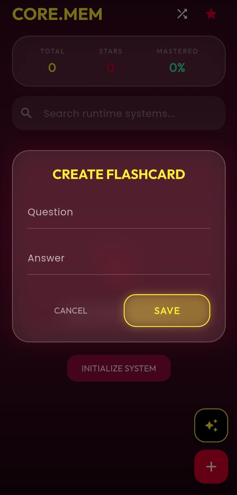
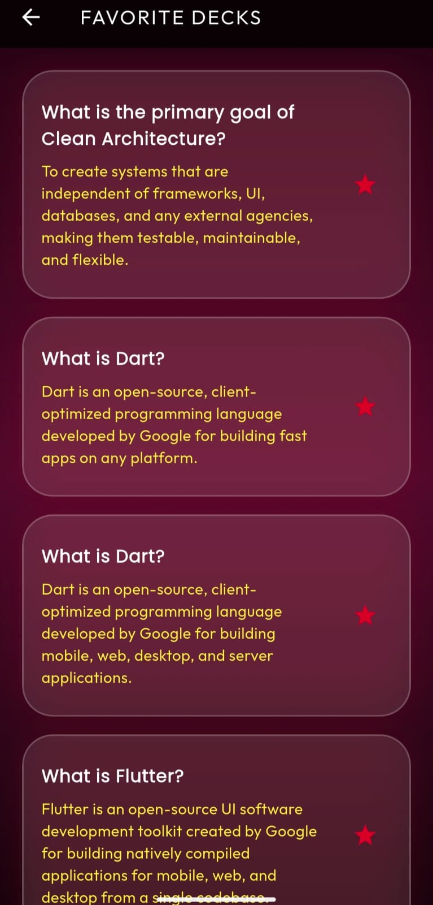
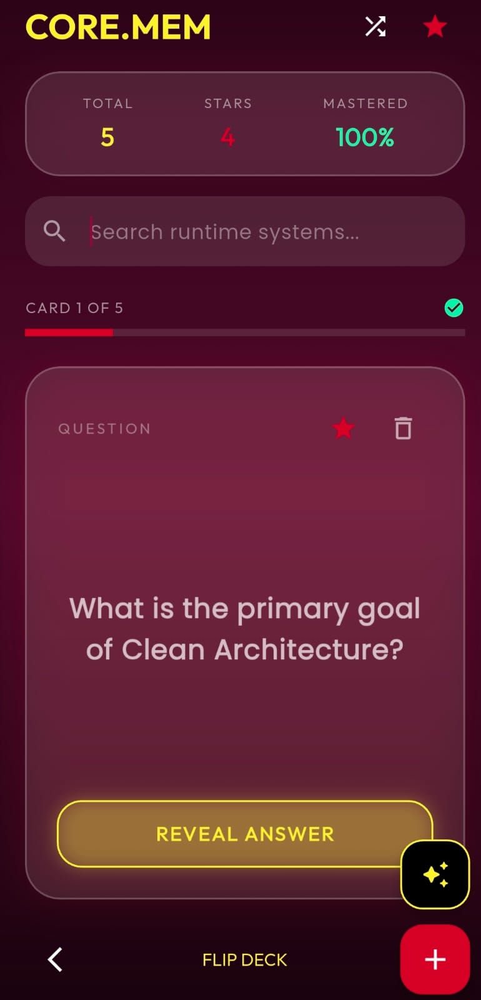

# 🧠 CORE.MEM Flashcards

A modern Flutter flashcard application designed to help users learn and memorize information efficiently through an intuitive and beautiful interface.

---

## ✨ Features

- 📚 Create and manage flashcards
- 🔍 Search flashcards
- 💾 Local data storage using Hive
- 🎨 Modern Neon UI
- 🌙 Dark Theme
- ⚡ Fast and responsive
- 📱 Cross-platform Flutter application

---

## 📸 Screenshots

### Splash Screen
(Add Screenshot Here)

### Home Screen
(Add Screenshot Here)

### Flashcard Screen
(Add Screenshot Here)

### Add Flashcard
(Add Screenshot Here)

---

## 🛠 Built With

- Flutter
- Dart
- Provider
- Hive Database
- Material Design

---

## 📂 Project Structure

lib/
├── models/
├── providers/
├── screens/
├── services/
├── theme/
├── widgets/
└── main.dart

---

## 🚀 Getting Started

### Clone Repository

```bash
git clone https://github.com/YOUR_USERNAME/core-mem-flashcards.git
```

### Open Project

```bash
cd core-mem-flashcards
```

### Install Dependencies

```bash
flutter pub get
```

### Run Application

```bash
flutter run
```

---

## 📦 Packages Used

- provider
- hive
- hive_flutter
- flutter

---

## 🎯 Future Improvements

- Firebase Authentication
- Cloud Sync
- Flashcard Categories
- Quiz Mode
- Statistics Dashboard
- AI Generated Flashcards

---

## 👩‍💻 Author

**Iqra Faisal**

Flutter Developer

GitHub: https://github.com/iqraatech

LinkedIn:
https://www.linkedin.com/in/iqra-faisal-a135b3323

# Screenshots

## Splash Screen


## Home Screen


## Flashcards


## Add Flashcard



## Add Favourites


## Add Card


## Add Aigenerator


---

## 📄 License

This project is licensed under the MIT License.